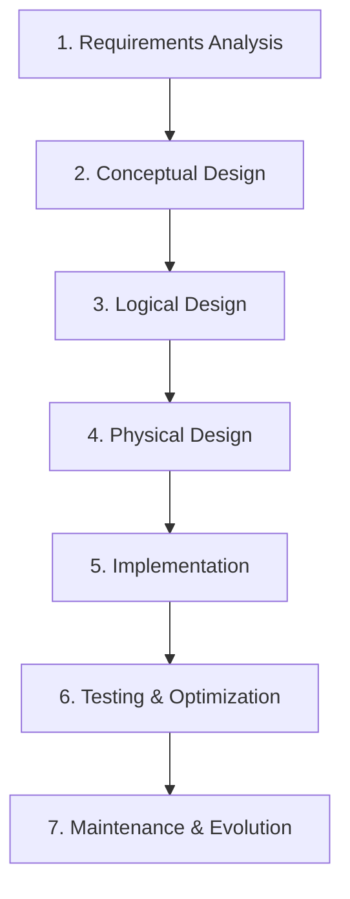

# Database Design va Schema Planning

Salom! Bu darsda biz professional database design qilishni o'rganamiz. Yaxshi dizayn qilingan schema - muvaffaqiyatli ilovaning poydevoridir.

## Bu darsdan nimani o'rganasiz?

- 🏗️ **Database Design Principles** - Asosiy tamoyillar va best practices
- 📊 **Entity-Relationship Modeling** - ER diagram va relationships
- 🔄 **Normalization** - 1NF, 2NF, 3NF va denormalization
- 🎯 **Schema Design Patterns** - Real-world loyihalar uchun patterns
- 🔒 **Constraints va Validation** - Ma'lumot consistency ta'minlash
- 🚀 **Performance Optimization** - Indexing va query strategies

---

## 1. Database Design Fundamentals 🏗️

### Design Process Overview

Database design - bu 6 bosqichli jarayon:



### 1. Requirements Analysis

```sql
-- Blog platformasi uchun requirements:
/*
FUNCTIONAL REQUIREMENTS:
- Foydalanuvchilar ro'yxatdan o'tishlari kerak
- Postlar yozish, tahrirlash, o'chirish
- Kategoriyalar va taglar qo'llab-quvvatlash
- Izohlar tizimi (nested comments)
- Like/dislike functionality
- User roles (admin, editor, author, reader)
- Search functionality
- File upload (images, documents)

NON-FUNCTIONAL REQUIREMENTS:
- 10,000+ concurrent users support
- Response time < 200ms
- 99.9% uptime
- Data backup va recovery
- Security (SQL injection prevention)
- Scalability (horizontal scaling)
*/
```

### 2. Core Design Principles

```sql
-- ACID Properties
/*
ATOMICITY: Transaction butunlay amalga oshishadi yoki butunlay bekor qilinadi
CONSISTENCY: Har bir transaction database'ni consistent holatda qoldiradi
ISOLATION: Parallel transactions bir-biriga ta'sir qilmaydi
DURABILITY: Commit qilingan ma'lumotlar doimiy saqlanadi
*/

-- Data Integrity
/*
ENTITY INTEGRITY: Har bir entity unique identifier'ga ega
REFERENTIAL INTEGRITY: Foreign key'lar valid parent record'larga reference qiladi
DOMAIN INTEGRITY: Column value'lar allowed data type va range'da
USER-DEFINED INTEGRITY: Business rule'lar constraint orqali ta'minlanadi
*/
```

---

## 2. Entity-Relationship (ER) Modeling 📊

### Entity va Attributes

```sql
-- Entity chiqarish va attributes aniqlash

-- ENTITY: User
CREATE TABLE users (
    -- Primary key (unique identifier)
    id SERIAL PRIMARY KEY,

    -- Required attributes
    username VARCHAR(50) UNIQUE NOT NULL,
    email VARCHAR(255) UNIQUE NOT NULL,
    password_hash VARCHAR(255) NOT NULL,

    -- Optional attributes
    first_name VARCHAR(100),
    last_name VARCHAR(100),
    bio TEXT,
    avatar_url VARCHAR(500),
    birth_date DATE,

    -- Computed attributes (mashina tomonidan qo'shiladigan)
    created_at TIMESTAMPTZ DEFAULT NOW(),
    updated_at TIMESTAMPTZ DEFAULT NOW(),

    -- Status attributes
    is_active BOOLEAN DEFAULT true,
    is_verified BOOLEAN DEFAULT false,

    -- Validation constraints
    CONSTRAINT valid_email CHECK (email ~* '^[A-Za-z0-9._%+-]+@[A-Za-z0-9.-]+\.[A-Za-z]{2,}$'),
    CONSTRAINT username_length CHECK (char_length(username) >= 3),
    CONSTRAINT valid_birth_date CHECK (birth_date IS NULL OR birth_date < CURRENT_DATE)
);

-- ENTITY: Post
CREATE TABLE posts (
    id SERIAL PRIMARY KEY,
    title VARCHAR(255) NOT NULL,
    slug VARCHAR(255) UNIQUE NOT NULL,
    content TEXT NOT NULL,
    excerpt TEXT,
    featured_image VARCHAR(500),

    -- Status management
    status VARCHAR(20) DEFAULT 'draft',
    visibility VARCHAR(20) DEFAULT 'public',

    -- SEO attributes
    meta_title VARCHAR(255),
    meta_description TEXT,

    -- Scheduling
    published_at TIMESTAMPTZ,
    scheduled_at TIMESTAMPTZ,

    -- Timestamps
    created_at TIMESTAMPTZ DEFAULT NOW(),
    updated_at TIMESTAMPTZ DEFAULT NOW(),

    -- Foreign keys (relationships)
    author_id INTEGER NOT NULL REFERENCES users(id),
    category_id INTEGER REFERENCES categories(id),

    -- Constraints
    CONSTRAINT valid_status CHECK (status IN ('draft', 'published', 'archived', 'scheduled')),
    CONSTRAINT valid_visibility CHECK (visibility IN ('public', 'private', 'password_protected')),
    CONSTRAINT published_posts_need_date CHECK (
        status != 'published' OR published_at IS NOT NULL
    )
);
```

### Relationship Types va Cardinality

```sql
-- 1. ONE-TO-ONE (1:1) Relationship
-- User va UserProfile
CREATE TABLE user_profiles (
    id SERIAL PRIMARY KEY,
    user_id INTEGER UNIQUE NOT NULL REFERENCES users(id) ON DELETE CASCADE,

    -- Extended profile information
    phone VARCHAR(20),
    address TEXT,
    city VARCHAR(100),
    country VARCHAR(100),
    timezone VARCHAR(50),
    language VARCHAR(10) DEFAULT 'uz',

    -- Social links
    website_url VARCHAR(500),
    social_links JSONB,

    -- Privacy settings
    profile_visibility VARCHAR(20) DEFAULT 'public',
    show_email BOOLEAN DEFAULT false,

    created_at TIMESTAMPTZ DEFAULT NOW(),
    updated_at TIMESTAMPTZ DEFAULT NOW(),

    CONSTRAINT valid_visibility CHECK (profile_visibility IN ('public', 'private', 'friends_only'))
);

-- 2. ONE-TO-MANY (1:N) Relationship
-- User -> Posts (bitta user ko'p postlarga ega)
-- Allaqachon posts jadvalida author_id foreign key bor

-- Categories -> Posts (bitta category ko'p postlarga ega)
CREATE TABLE categories (
    id SERIAL PRIMARY KEY,
    name VARCHAR(100) UNIQUE NOT NULL,
    slug VARCHAR(100) UNIQUE NOT NULL,
    description TEXT,
    color VARCHAR(7), -- Hex color code
    icon VARCHAR(50), -- Icon class name

    -- Hierarchical categories
    parent_id INTEGER REFERENCES categories(id),
    sort_order INTEGER DEFAULT 0,

    -- SEO
    meta_title VARCHAR(255),
    meta_description TEXT,

    -- Status
    is_active BOOLEAN DEFAULT true,

    created_at TIMESTAMPTZ DEFAULT NOW(),
    updated_at TIMESTAMPTZ DEFAULT NOW(),

    CONSTRAINT valid_hex_color CHECK (color IS NULL OR color ~* '^#[0-9A-Fa-f]{6}$')
);

-- 3. MANY-TO-MANY (M:N) Relationship
-- Posts <-> Tags (ko'p postlar ko'p taglarga ega bo'lishi mumkin)
CREATE TABLE tags (
    id SERIAL PRIMARY KEY,
    name VARCHAR(50) UNIQUE NOT NULL,
    slug VARCHAR(50) UNIQUE NOT NULL,
    description TEXT,
    color VARCHAR(7),

    -- Usage statistics
    posts_count INTEGER DEFAULT 0,

    created_at TIMESTAMPTZ DEFAULT NOW(),
    updated_at TIMESTAMPTZ DEFAULT NOW()
);

-- Junction table (bridge table)
CREATE TABLE post_tags (
    post_id INTEGER REFERENCES posts(id) ON DELETE CASCADE,
    tag_id INTEGER REFERENCES tags(id) ON DELETE CASCADE,
    created_at TIMESTAMPTZ DEFAULT NOW(),

    PRIMARY KEY (post_id, tag_id)
);

-- Users <-> Posts (Favorites/Bookmarks)
CREATE TABLE user_favorite_posts (
    user_id INTEGER REFERENCES users(id) ON DELETE CASCADE,
    post_id INTEGER REFERENCES posts(id) ON DELETE CASCADE,
    created_at TIMESTAMPTZ DEFAULT NOW(),

    PRIMARY KEY (user_id, post_id)
);
```

### Self-Referencing Relationships

```sql
-- Comment system (nested comments)
CREATE TABLE comments (
    id SERIAL PRIMARY KEY,
    content TEXT NOT NULL,

    -- Relationships
    post_id INTEGER NOT NULL REFERENCES posts(id) ON DELETE CASCADE,
    user_id INTEGER REFERENCES users(id) ON DELETE SET NULL,  -- Anonymous comments allowed
    parent_comment_id INTEGER REFERENCES comments(id) ON DELETE CASCADE,

    -- Status
    status VARCHAR(20) DEFAULT 'pending',
    is_featured BOOLEAN DEFAULT false,

    -- Interaction metrics
    likes_count INTEGER DEFAULT 0,
    replies_count INTEGER DEFAULT 0,

    -- Moderation
    moderated_by INTEGER REFERENCES users(id),
    moderated_at TIMESTAMPTZ,
    moderation_reason TEXT,

    created_at TIMESTAMPTZ DEFAULT NOW(),
    updated_at TIMESTAMPTZ DEFAULT NOW(),

    CONSTRAINT valid_status CHECK (status IN ('pending', 'approved', 'rejected', 'spam')),
    CONSTRAINT no_self_parent CHECK (id != parent_comment_id)
);

-- Menu system (hierarchical navigation)
CREATE TABLE menu_items (
    id SERIAL PRIMARY KEY,
    title VARCHAR(100) NOT NULL,
    url VARCHAR(500),
    icon VARCHAR(50),

    -- Hierarchy
    parent_id INTEGER REFERENCES menu_items(id) ON DELETE CASCADE,
    sort_order INTEGER DEFAULT 0,
    level INTEGER GENERATED ALWAYS AS (
        CASE WHEN parent_id IS NULL THEN 0 ELSE 1 END
    ) STORED,

    -- Visibility
    is_active BOOLEAN DEFAULT true,
    requires_auth BOOLEAN DEFAULT false,
    roles TEXT[], -- JSON array of allowed roles

    created_at TIMESTAMPTZ DEFAULT NOW()
);
```

---

## 3. Normalization va Database Normal Forms 🔄

### 1st Normal Form (1NF) - Atomic Values

```sql
-- ❌ NOTO'G'RI: 1NF buzilgan
CREATE TABLE users_bad (
    id SERIAL PRIMARY KEY,
    name VARCHAR(200),
    phones VARCHAR(500), -- "123-456-7890, 098-765-4321" - Ko'p qiymat bitta field'da
    skills VARCHAR(500)  -- "JavaScript, Python, React" - Repeating group
);

-- ✅ TO'G'RI: 1NF qoidasiga mos
CREATE TABLE users_good (
    id SERIAL PRIMARY KEY,
    first_name VARCHAR(100) NOT NULL,
    last_name VARCHAR(100) NOT NULL,
    created_at TIMESTAMPTZ DEFAULT NOW()
);

CREATE TABLE user_phones (
    id SERIAL PRIMARY KEY,
    user_id INTEGER REFERENCES users_good(id) ON DELETE CASCADE,
    phone VARCHAR(20) NOT NULL,
    phone_type VARCHAR(20) DEFAULT 'mobile', -- 'mobile', 'home', 'work'
    is_primary BOOLEAN DEFAULT false,
    created_at TIMESTAMPTZ DEFAULT NOW(),

    CONSTRAINT valid_phone_type CHECK (phone_type IN ('mobile', 'home', 'work', 'other'))
);

CREATE TABLE user_skills (
    id SERIAL PRIMARY KEY,
    user_id INTEGER REFERENCES users_good(id) ON DELETE CASCADE,
    skill_name VARCHAR(100) NOT NULL,
    proficiency_level INTEGER CHECK (proficiency_level BETWEEN 1 AND 5),
    years_experience INTEGER CHECK (years_experience >= 0),
    created_at TIMESTAMPTZ DEFAULT NOW(),

    UNIQUE(user_id, skill_name)
);
```

### 2nd Normal Form (2NF) - Remove Partial Dependencies

```sql
-- ❌ NOTO'G'RI: 2NF buzilgan
CREATE TABLE order_details_bad (
    order_id INTEGER,
    product_id INTEGER,
    product_name VARCHAR(255), -- product_id'ga bog'liq, order_id'ga emas
    product_price DECIMAL(10,2), -- product_id'ga bog'liq, order_id'ga emas
    quantity INTEGER,

    PRIMARY KEY (order_id, product_id) -- Composite primary key
);

-- ✅ TO'G'RI: 2NF qoidasiga mos
CREATE TABLE products_normalized (
    id SERIAL PRIMARY KEY,
    name VARCHAR(255) NOT NULL,
    price DECIMAL(10,2) NOT NULL,
    description TEXT,
    sku VARCHAR(100) UNIQUE NOT NULL,
    created_at TIMESTAMPTZ DEFAULT NOW()
);

CREATE TABLE orders_normalized (
    id SERIAL PRIMARY KEY,
    order_number VARCHAR(50) UNIQUE NOT NULL,
    user_id INTEGER REFERENCES users(id),
    total_amount DECIMAL(10,2) NOT NULL,
    status VARCHAR(20) DEFAULT 'pending',
    created_at TIMESTAMPTZ DEFAULT NOW()
);

CREATE TABLE order_items_normalized (
    id SERIAL PRIMARY KEY,
    order_id INTEGER REFERENCES orders_normalized(id) ON DELETE CASCADE,
    product_id INTEGER REFERENCES products_normalized(id),
    quantity INTEGER NOT NULL CHECK (quantity > 0),
    unit_price DECIMAL(10,2) NOT NULL, -- Order vaqtidagi narx (snapshot)
    total_price DECIMAL(10,2) NOT NULL,
    created_at TIMESTAMPTZ DEFAULT NOW(),

    UNIQUE(order_id, product_id)
);
```

### 3rd Normal Form (3NF) - Remove Transitive Dependencies

```sql
-- ❌ NOTO'G'RI: 3NF buzilgan
CREATE TABLE employees_bad (
    id SERIAL PRIMARY KEY,
    name VARCHAR(200),
    department_id INTEGER,
    department_name VARCHAR(100), -- department_id'ga bog'liq (transitive dependency)
    department_manager VARCHAR(100), -- department_id'ga bog'liq
    salary DECIMAL(10,2)
);

-- ✅ TO'G'RI: 3NF qoidasiga mos
CREATE TABLE departments (
    id SERIAL PRIMARY KEY,
    name VARCHAR(100) UNIQUE NOT NULL,
    description TEXT,
    manager_name VARCHAR(100),
    budget DECIMAL(12,2),
    location VARCHAR(100),
    created_at TIMESTAMPTZ DEFAULT NOW()
);

CREATE TABLE employees_good (
    id SERIAL PRIMARY KEY,
    first_name VARCHAR(100) NOT NULL,
    last_name VARCHAR(100) NOT NULL,
    email VARCHAR(255) UNIQUE NOT NULL,
    department_id INTEGER REFERENCES departments(id),
    position VARCHAR(100),
    salary DECIMAL(10,2),
    hire_date DATE,
    is_active BOOLEAN DEFAULT true,
    created_at TIMESTAMPTZ DEFAULT NOW()
);

-- Employee performance reviews (separate concern)
CREATE TABLE employee_reviews (
    id SERIAL PRIMARY KEY,
    employee_id INTEGER REFERENCES employees_good(id) ON DELETE CASCADE,
    reviewer_id INTEGER REFERENCES employees_good(id),
    review_period VARCHAR(20), -- '2024-Q1', '2024-H1', etc.
    performance_rating INTEGER CHECK (performance_rating BETWEEN 1 AND 5),
    goals_met BOOLEAN,
    comments TEXT,
    review_date DATE NOT NULL,
    created_at TIMESTAMPTZ DEFAULT NOW(),

    UNIQUE(employee_id, review_period)
);
```

### Denormalization for Performance

```sql
-- Ba'zan performance uchun denormalization zarur
CREATE TABLE posts_with_stats (
    id SERIAL PRIMARY KEY,
    title VARCHAR(255) NOT NULL,
    content TEXT NOT NULL,
    author_id INTEGER REFERENCES users(id),
    category_id INTEGER REFERENCES categories(id),

    -- Denormalized fields (performance uchun)
    author_name VARCHAR(200), -- users.first_name + last_name'dan computed
    category_name VARCHAR(100), -- categories.name'dan copy

    -- Aggregate statistics (cache sifatida)
    comments_count INTEGER DEFAULT 0,
    likes_count INTEGER DEFAULT 0,
    views_count INTEGER DEFAULT 0,

    -- Search optimization
    search_vector TSVECTOR, -- Full-text search uchun

    created_at TIMESTAMPTZ DEFAULT NOW(),
    updated_at TIMESTAMPTZ DEFAULT NOW(),

    -- Denormalized data'ni fresh tutish uchun triggers kerak
    stats_updated_at TIMESTAMPTZ DEFAULT NOW()
);

-- Aggregate ma'lumotlarni yangilash function
CREATE OR REPLACE FUNCTION update_post_stats()
RETURNS TRIGGER AS $$
BEGIN
    -- Comments count yangilash
    UPDATE posts_with_stats
    SET comments_count = (
        SELECT COUNT(*)
        FROM comments
        WHERE post_id = NEW.post_id AND status = 'approved'
    ),
    stats_updated_at = NOW()
    WHERE id = NEW.post_id;

    RETURN NEW;
END;
$$ LANGUAGE plpgsql;

-- Trigger yaratish
CREATE TRIGGER update_post_comments_count
    AFTER INSERT OR UPDATE OR DELETE ON comments
    FOR EACH ROW
    EXECUTE FUNCTION update_post_stats();
```

---

## 4. Schema Design Patterns 🎯

### Pattern 1: User Management System

```sql
-- Flexible user roles va permissions system
CREATE TABLE roles (
    id SERIAL PRIMARY KEY,
    name VARCHAR(50) UNIQUE NOT NULL,
    description TEXT,
    level INTEGER UNIQUE, -- Role hierarchy (1=highest)
    is_active BOOLEAN DEFAULT true,
    created_at TIMESTAMPTZ DEFAULT NOW()
);

CREATE TABLE permissions (
    id SERIAL PRIMARY KEY,
    name VARCHAR(100) UNIQUE NOT NULL, -- 'posts.create', 'users.delete'
    description TEXT,
    resource VARCHAR(50) NOT NULL, -- 'posts', 'users', 'comments'
    action VARCHAR(50) NOT NULL, -- 'create', 'read', 'update', 'delete'
    created_at TIMESTAMPTZ DEFAULT NOW(),

    UNIQUE(resource, action)
);

CREATE TABLE role_permissions (
    role_id INTEGER REFERENCES roles(id) ON DELETE CASCADE,
    permission_id INTEGER REFERENCES permissions(id) ON DELETE CASCADE,
    granted_at TIMESTAMPTZ DEFAULT NOW(),
    granted_by INTEGER REFERENCES users(id),

    PRIMARY KEY (role_id, permission_id)
);

CREATE TABLE user_roles (
    user_id INTEGER REFERENCES users(id) ON DELETE CASCADE,
    role_id INTEGER REFERENCES roles(id) ON DELETE CASCADE,
    assigned_at TIMESTAMPTZ DEFAULT NOW(),
    assigned_by INTEGER REFERENCES users(id),
    expires_at TIMESTAMPTZ, -- Optional role expiration

    PRIMARY KEY (user_id, role_id)
);

-- Sample data
INSERT INTO roles (name, description, level) VALUES
('super_admin', 'Full system access', 1),
('admin', 'Administrative access', 2),
('editor', 'Content management access', 3),
('author', 'Content creation access', 4),
('subscriber', 'Read-only access', 5);

INSERT INTO permissions (name, description, resource, action) VALUES
('posts.create', 'Create new posts', 'posts', 'create'),
('posts.edit', 'Edit any posts', 'posts', 'update'),
('posts.delete', 'Delete any posts', 'posts', 'delete'),
('users.manage', 'Manage user accounts', 'users', 'manage'),
('comments.moderate', 'Moderate comments', 'comments', 'moderate');
```

### Pattern 2: E-commerce Flexibility

```sql
-- Product variation system (color, size, etc.)
CREATE TABLE product_attributes (
    id SERIAL PRIMARY KEY,
    name VARCHAR(100) UNIQUE NOT NULL, -- 'color', 'size', 'material'
    display_name VARCHAR(100) NOT NULL,
    attribute_type VARCHAR(20) DEFAULT 'select', -- 'select', 'text', 'number', 'boolean'
    is_filterable BOOLEAN DEFAULT true,
    is_required BOOLEAN DEFAULT false,
    sort_order INTEGER DEFAULT 0,
    created_at TIMESTAMPTZ DEFAULT NOW(),

    CONSTRAINT valid_type CHECK (attribute_type IN ('select', 'text', 'number', 'boolean', 'date'))
);

CREATE TABLE attribute_values (
    id SERIAL PRIMARY KEY,
    attribute_id INTEGER REFERENCES product_attributes(id) ON DELETE CASCADE,
    value VARCHAR(255) NOT NULL,
    display_value VARCHAR(255),
    color_code VARCHAR(7), -- Ranglar uchun hex code
    sort_order INTEGER DEFAULT 0,
    created_at TIMESTAMPTZ DEFAULT NOW(),

    UNIQUE(attribute_id, value)
);

CREATE TABLE product_variants (
    id SERIAL PRIMARY KEY,
    product_id INTEGER REFERENCES products(id) ON DELETE CASCADE,
    sku VARCHAR(100) UNIQUE NOT NULL,
    price DECIMAL(10,2),
    stock_quantity INTEGER DEFAULT 0,
    weight DECIMAL(8,3),
    is_active BOOLEAN DEFAULT true,
    created_at TIMESTAMPTZ DEFAULT NOW()
);

CREATE TABLE variant_attributes (
    variant_id INTEGER REFERENCES product_variants(id) ON DELETE CASCADE,
    attribute_value_id INTEGER REFERENCES attribute_values(id) ON DELETE CASCADE,

    PRIMARY KEY (variant_id, attribute_value_id)
);

-- Image management
CREATE TABLE product_images (
    id SERIAL PRIMARY KEY,
    product_id INTEGER REFERENCES products(id) ON DELETE CASCADE,
    variant_id INTEGER REFERENCES product_variants(id) ON DELETE SET NULL,
    image_url VARCHAR(500) NOT NULL,
    alt_text VARCHAR(255),
    is_primary BOOLEAN DEFAULT false,
    sort_order INTEGER DEFAULT 0,
    created_at TIMESTAMPTZ DEFAULT NOW()
);
```

### Pattern 3: Content Management System (CMS)

```sql
-- Flexible content types
CREATE TABLE content_types (
    id SERIAL PRIMARY KEY,
    name VARCHAR(100) UNIQUE NOT NULL, -- 'page', 'article', 'event', 'product'
    display_name VARCHAR(100) NOT NULL,
    description TEXT,
    icon VARCHAR(50),
    is_active BOOLEAN DEFAULT true,
    created_at TIMESTAMPTZ DEFAULT NOW()
);

CREATE TABLE content_fields (
    id SERIAL PRIMARY KEY,
    content_type_id INTEGER REFERENCES content_types(id) ON DELETE CASCADE,
    field_name VARCHAR(100) NOT NULL,
    display_name VARCHAR(100) NOT NULL,
    field_type VARCHAR(20) NOT NULL, -- 'text', 'textarea', 'rich_text', 'image', 'date'
    is_required BOOLEAN DEFAULT false,
    default_value TEXT,
    validation_rules JSONB, -- {"min_length": 5, "max_length": 100}
    sort_order INTEGER DEFAULT 0,
    created_at TIMESTAMPTZ DEFAULT NOW(),

    UNIQUE(content_type_id, field_name),
    CONSTRAINT valid_field_type CHECK (
        field_type IN ('text', 'textarea', 'rich_text', 'image', 'date', 'number', 'boolean', 'select', 'multiselect')
    )
);

CREATE TABLE content_items (
    id SERIAL PRIMARY KEY,
    content_type_id INTEGER REFERENCES content_types(id),
    title VARCHAR(255) NOT NULL,
    slug VARCHAR(255) UNIQUE NOT NULL,
    status VARCHAR(20) DEFAULT 'draft',
    author_id INTEGER REFERENCES users(id),

    -- SEO fields
    meta_title VARCHAR(255),
    meta_description TEXT,

    -- Publishing
    published_at TIMESTAMPTZ,
    expires_at TIMESTAMPTZ,

    created_at TIMESTAMPTZ DEFAULT NOW(),
    updated_at TIMESTAMPTZ DEFAULT NOW(),

    CONSTRAINT valid_status CHECK (status IN ('draft', 'published', 'archived', 'scheduled'))
);

CREATE TABLE content_field_values (
    id SERIAL PRIMARY KEY,
    content_item_id INTEGER REFERENCES content_items(id) ON DELETE CASCADE,
    content_field_id INTEGER REFERENCES content_fields(id) ON DELETE CASCADE,
    field_value TEXT, -- JSON for complex data
    created_at TIMESTAMPTZ DEFAULT NOW(),

    UNIQUE(content_item_id, content_field_id)
);
```

---

## 5. Advanced Constraint Patterns 🔒

### Business Rules Implementation

```sql
-- Complex business constraints
CREATE TABLE subscription_plans (
    id SERIAL PRIMARY KEY,
    name VARCHAR(100) UNIQUE NOT NULL,
    price DECIMAL(8,2) NOT NULL CHECK (price >= 0),
    billing_cycle VARCHAR(20) NOT NULL, -- 'monthly', 'yearly'
    max_users INTEGER CHECK (max_users > 0),
    max_storage_gb INTEGER CHECK (max_storage_gb > 0),
    features JSONB, -- {"api_access": true, "priority_support": false}
    is_active BOOLEAN DEFAULT true,
    created_at TIMESTAMPTZ DEFAULT NOW(),

    CONSTRAINT valid_billing_cycle CHECK (billing_cycle IN ('monthly', 'yearly', 'lifetime'))
);

CREATE TABLE user_subscriptions (
    id SERIAL PRIMARY KEY,
    user_id INTEGER REFERENCES users(id) ON DELETE CASCADE,
    plan_id INTEGER REFERENCES subscription_plans(id),

    -- Billing information
    starts_at TIMESTAMPTZ NOT NULL,
    ends_at TIMESTAMPTZ,
    auto_renew BOOLEAN DEFAULT true,

    -- Payment tracking
    stripe_subscription_id VARCHAR(100),
    last_payment_at TIMESTAMPTZ,
    next_billing_at TIMESTAMPTZ,

    -- Status management
    status VARCHAR(20) DEFAULT 'active',
    cancelled_at TIMESTAMPTZ,
    cancellation_reason TEXT,

    created_at TIMESTAMPTZ DEFAULT NOW(),
    updated_at TIMESTAMPTZ DEFAULT NOW(),

    -- Business constraints
    CONSTRAINT valid_status CHECK (status IN ('active', 'cancelled', 'expired', 'past_due', 'trialing')),
    CONSTRAINT valid_subscription_period CHECK (starts_at < ends_at OR ends_at IS NULL),
    CONSTRAINT no_overlapping_subscriptions EXCLUDE USING gist (
        user_id WITH =,
        tstzrange(starts_at, COALESCE(ends_at, 'infinity'::timestamptz)) WITH &&
    ) WHERE (status = 'active')
);

-- Audit trail pattern
CREATE TABLE audit_log (
    id SERIAL PRIMARY KEY,
    table_name VARCHAR(100) NOT NULL,
    record_id INTEGER NOT NULL,
    action VARCHAR(20) NOT NULL, -- 'INSERT', 'UPDATE', 'DELETE'
    old_values JSONB,
    new_values JSONB,
    changed_fields TEXT[],
    user_id INTEGER REFERENCES users(id),
    ip_address INET,
    user_agent TEXT,
    created_at TIMESTAMPTZ DEFAULT NOW(),

    CONSTRAINT valid_action CHECK (action IN ('INSERT', 'UPDATE', 'DELETE'))
);

-- Generic audit function
CREATE OR REPLACE FUNCTION create_audit_trigger()
RETURNS TRIGGER AS $$
BEGIN
    IF TG_OP = 'DELETE' THEN
        INSERT INTO audit_log (table_name, record_id, action, old_values, user_id)
        VALUES (TG_TABLE_NAME, OLD.id, TG_OP, row_to_json(OLD), current_setting('app.user_id', true)::integer);
        RETURN OLD;
    ELSIF TG_OP = 'INSERT' THEN
        INSERT INTO audit_log (table_name, record_id, action, new_values, user_id)
        VALUES (TG_TABLE_NAME, NEW.id, TG_OP, row_to_json(NEW), current_setting('app.user_id', true)::integer);
        RETURN NEW;
    ELSIF TG_OP = 'UPDATE' THEN
        INSERT INTO audit_log (table_name, record_id, action, old_values, new_values, user_id)
        VALUES (TG_TABLE_NAME, NEW.id, TG_OP, row_to_json(OLD), row_to_json(NEW), current_setting('app.user_id', true)::integer);
        RETURN NEW;
    END IF;
    RETURN NULL;
END;
$$ LANGUAGE plpgsql;

-- Apply audit trigger to tables
CREATE TRIGGER users_audit_trigger
    AFTER INSERT OR UPDATE OR DELETE ON users
    FOR EACH ROW EXECUTE FUNCTION create_audit_trigger();
```

### Soft Delete Pattern

```sql
-- Soft delete implementation
CREATE TABLE soft_deletable_posts (
    id SERIAL PRIMARY KEY,
    title VARCHAR(255) NOT NULL,
    content TEXT NOT NULL,
    author_id INTEGER REFERENCES users(id),

    -- Soft delete fields
    deleted_at TIMESTAMPTZ,
    deleted_by INTEGER REFERENCES users(id),
    deletion_reason TEXT,

    created_at TIMESTAMPTZ DEFAULT NOW(),
    updated_at TIMESTAMPTZ DEFAULT NOW()
);

-- View uchun only active records
CREATE VIEW active_posts AS
SELECT * FROM soft_deletable_posts
WHERE deleted_at IS NULL;

-- Soft delete function
CREATE OR REPLACE FUNCTION soft_delete_post(post_id INTEGER, deleter_id INTEGER, reason TEXT DEFAULT NULL)
RETURNS BOOLEAN AS $$
DECLARE
    affected_rows INTEGER;
BEGIN
    UPDATE soft_deletable_posts
    SET deleted_at = NOW(),
        deleted_by = deleter_id,
        deletion_reason = reason,
        updated_at = NOW()
    WHERE id = post_id AND deleted_at IS NULL;

    GET DIAGNOSTICS affected_rows = ROW_COUNT;
    RETURN affected_rows > 0;
END;
$$ LANGUAGE plpgsql;

-- Restore function
CREATE OR REPLACE FUNCTION restore_post(post_id INTEGER)
RETURNS BOOLEAN AS $$
DECLARE
    affected_rows INTEGER;
BEGIN
    UPDATE soft_deletable_posts
    SET deleted_at = NULL,
        deleted_by = NULL,
        deletion_reason = NULL,
        updated_at = NOW()
    WHERE id = post_id AND deleted_at IS NOT NULL;

    GET DIAGNOSTICS affected_rows = ROW_COUNT;
    RETURN affected_rows > 0;
END;
$$ LANGUAGE plpgsql;
```

---

## 6. Performance Optimization Strategies 🚀

### Indexing Strategy

```sql
-- 1. Single column indexes
CREATE INDEX idx_posts_author_id ON posts(author_id);
CREATE INDEX idx_posts_published_at ON posts(published_at)
WHERE status = 'published';

-- 2. Composite indexes (order matters!)
-- Query: WHERE category_id = ? AND status = ? ORDER BY created_at DESC
CREATE INDEX idx_posts_category_status_date ON posts(category_id, status, created_at DESC);

-- 3. Partial indexes
CREATE INDEX idx_active_users_email ON users(email)
WHERE is_active = true;

CREATE INDEX idx_published_posts_date ON posts(published_at)
WHERE status = 'published' AND published_at IS NOT NULL;

-- 4. Functional indexes
CREATE INDEX idx_posts_title_lower ON posts(LOWER(title));
CREATE INDEX idx_users_full_name ON users((first_name || ' ' || last_name));

-- 5. Full-text search indexes
ALTER TABLE posts ADD COLUMN search_vector TSVECTOR;

UPDATE posts SET search_vector =
    to_tsvector('english', coalesce(title, '') || ' ' || coalesce(content, ''));

CREATE INDEX idx_posts_search ON posts USING gin(search_vector);

-- 6. JSON indexes
CREATE INDEX idx_user_profiles_social_links ON user_profiles USING gin(social_links);

-- 7. Array indexes
CREATE INDEX idx_menu_items_roles ON menu_items USING gin(roles);
```

### Query Optimization Patterns

```sql
-- 1. Explain qanday ishlatish
EXPLAIN (ANALYZE, BUFFERS, VERBOSE)
SELECT p.title, u.username, c.name as category
FROM posts p
JOIN users u ON p.author_id = u.id
JOIN categories c ON p.category_id = c.id
WHERE p.status = 'published'
  AND p.published_at > NOW() - INTERVAL '30 days'
ORDER BY p.published_at DESC
LIMIT 10;

-- 2. Window functions for pagination (cursor-based)
-- ❌ NOTO'G'RI: OFFSET ishlatish
SELECT * FROM posts ORDER BY id LIMIT 10 OFFSET 10000; -- Sekin!

-- ✅ TO'G'RI: Cursor-based pagination
SELECT * FROM posts
WHERE id < $last_seen_id
ORDER BY id DESC
LIMIT 10;

-- 3. EXISTS vs IN performance
-- EXISTS ko'pincha tezroq
SELECT u.username FROM users u
WHERE EXISTS (
    SELECT 1 FROM posts p
    WHERE p.author_id = u.id AND p.status = 'published'
);

-- 4. Aggregate optimization
-- ❌ Sekin: Har safar hisoblash
SELECT p.*, (
    SELECT COUNT(*) FROM comments c
    WHERE c.post_id = p.id AND c.status = 'approved'
) as comments_count
FROM posts p;

-- ✅ Tez: Counter column ishlatish
SELECT p.*, p.comments_count
FROM posts_with_stats p;

-- 5. Batch operations
-- ❌ Loop ichida query
-- FOR each user: INSERT INTO user_logs...

-- ✅ Single batch insert
INSERT INTO user_logs (user_id, action, created_at)
SELECT id, 'login', NOW()
FROM users
WHERE last_login_at < NOW() - INTERVAL '1 day';
```

### Database Partitioning

```sql
-- Table partitioning (PostgreSQL 10+)
-- Time-based partitioning for logs
CREATE TABLE user_activity_logs (
    id SERIAL,
    user_id INTEGER NOT NULL,
    action VARCHAR(100) NOT NULL,
    ip_address INET,
    user_agent TEXT,
    created_at TIMESTAMPTZ NOT NULL DEFAULT NOW()
) PARTITION BY RANGE (created_at);

-- Monthly partitions
CREATE TABLE user_activity_logs_2024_01 PARTITION OF user_activity_logs
    FOR VALUES FROM ('2024-01-01') TO ('2024-02-01');

CREATE TABLE user_activity_logs_2024_02 PARTITION OF user_activity_logs
    FOR VALUES FROM ('2024-02-01') TO ('2024-03-01');

-- Automatic partition management function
CREATE OR REPLACE FUNCTION create_monthly_partition(table_name TEXT, start_date DATE)
RETURNS VOID AS $$
DECLARE
    partition_name TEXT;
    end_date DATE;
BEGIN
    end_date := start_date + INTERVAL '1 month';
    partition_name := table_name || '_' || to_char(start_date, 'YYYY_MM');

    EXECUTE format('CREATE TABLE %I PARTITION OF %I FOR VALUES FROM (%L) TO (%L)',
                   partition_name, table_name, start_date, end_date);

    EXECUTE format('CREATE INDEX ON %I (user_id)', partition_name);
    EXECUTE format('CREATE INDEX ON %I (created_at)', partition_name);
END;
$$ LANGUAGE plpgsql;
```

---

## 7. Real-World Schema Example: Blog Platform 💡

Keling to'liq blog platform uchun optimized schema yaratamiz:

```sql
-- Complete blog platform schema
-- 1. Core entities
CREATE TABLE users (
    id SERIAL PRIMARY KEY,
    username VARCHAR(50) UNIQUE NOT NULL,
    email VARCHAR(255) UNIQUE NOT NULL,
    password_hash VARCHAR(255) NOT NULL,
    first_name VARCHAR(100),
    last_name VARCHAR(100),
    bio TEXT,
    avatar_url VARCHAR(500),

    -- Account status
    is_active BOOLEAN DEFAULT true,
    is_verified BOOLEAN DEFAULT false,
    email_verified_at TIMESTAMPTZ,

    -- Settings
    timezone VARCHAR(50) DEFAULT 'UTC',
    language VARCHAR(10) DEFAULT 'en',

    -- Security
    two_factor_enabled BOOLEAN DEFAULT false,
    last_login_at TIMESTAMPTZ,
    failed_login_attempts INTEGER DEFAULT 0,
    locked_until TIMESTAMPTZ,

    -- Timestamps
    created_at TIMESTAMPTZ DEFAULT NOW(),
    updated_at TIMESTAMPTZ DEFAULT NOW(),

    -- Constraints
    CONSTRAINT valid_email CHECK (email ~* '^[A-Za-z0-9._%+-]+@[A-Za-z0-9.-]+\.[A-Za-z]{2,}$'),
    CONSTRAINT username_length CHECK (char_length(username) >= 3)
);

-- 2. Content structure
CREATE TABLE categories (
    id SERIAL PRIMARY KEY,
    name VARCHAR(100) UNIQUE NOT NULL,
    slug VARCHAR(100) UNIQUE NOT NULL,
    description TEXT,
    parent_id INTEGER REFERENCES categories(id),

    -- Display
    color VARCHAR(7),
    icon VARCHAR(50),
    sort_order INTEGER DEFAULT 0,

    -- SEO
    meta_title VARCHAR(255),
    meta_description TEXT,

    -- Status
    is_active BOOLEAN DEFAULT true,
    posts_count INTEGER DEFAULT 0,

    created_at TIMESTAMPTZ DEFAULT NOW(),
    updated_at TIMESTAMPTZ DEFAULT NOW()
);

CREATE TABLE posts (
    id SERIAL PRIMARY KEY,
    title VARCHAR(255) NOT NULL,
    slug VARCHAR(255) UNIQUE NOT NULL,
    content TEXT NOT NULL,
    excerpt TEXT,

    -- Media
    featured_image VARCHAR(500),
    featured_image_alt TEXT,

    -- SEO
    meta_title VARCHAR(255),
    meta_description TEXT,

    -- Publishing
    status VARCHAR(20) DEFAULT 'draft',
    visibility VARCHAR(20) DEFAULT 'public',
    password VARCHAR(100), -- For password protected posts
    published_at TIMESTAMPTZ,
    scheduled_at TIMESTAMPTZ,

    -- Relationships
    author_id INTEGER NOT NULL REFERENCES users(id),
    category_id INTEGER REFERENCES categories(id),

    -- Engagement metrics (denormalized for performance)
    views_count INTEGER DEFAULT 0,
    likes_count INTEGER DEFAULT 0,
    comments_count INTEGER DEFAULT 0,
    shares_count INTEGER DEFAULT 0,

    -- Search
    search_vector TSVECTOR,

    -- Timestamps
    created_at TIMESTAMPTZ DEFAULT NOW(),
    updated_at TIMESTAMPTZ DEFAULT NOW(),

    -- Constraints
    CONSTRAINT valid_status CHECK (status IN ('draft', 'published', 'archived', 'scheduled')),
    CONSTRAINT valid_visibility CHECK (visibility IN ('public', 'private', 'password_protected')),
    CONSTRAINT published_posts_have_date CHECK (
        status != 'published' OR published_at IS NOT NULL
    ),
    CONSTRAINT scheduled_posts_have_date CHECK (
        status != 'scheduled' OR scheduled_at IS NOT NULL
    )
);

-- 3. Tagging system
CREATE TABLE tags (
    id SERIAL PRIMARY KEY,
    name VARCHAR(50) UNIQUE NOT NULL,
    slug VARCHAR(50) UNIQUE NOT NULL,
    description TEXT,
    color VARCHAR(7),

    -- Stats
    posts_count INTEGER DEFAULT 0,

    created_at TIMESTAMPTZ DEFAULT NOW()
);

CREATE TABLE post_tags (
    post_id INTEGER REFERENCES posts(id) ON DELETE CASCADE,
    tag_id INTEGER REFERENCES tags(id) ON DELETE CASCADE,
    created_at TIMESTAMPTZ DEFAULT NOW(),

    PRIMARY KEY (post_id, tag_id)
);

-- 4. Comments system with threading
CREATE TABLE comments (
    id SERIAL PRIMARY KEY,
    content TEXT NOT NULL,

    -- Relationships
    post_id INTEGER NOT NULL REFERENCES posts(id) ON DELETE CASCADE,
    user_id INTEGER REFERENCES users(id) ON DELETE SET NULL,
    parent_comment_id INTEGER REFERENCES comments(id) ON DELETE CASCADE,

    -- Hierarchy helpers
    thread_id INTEGER NOT NULL,
    depth INTEGER DEFAULT 0,
    path TEXT, -- e.g., "1.5.23" for nested structure

    -- Status
    status VARCHAR(20) DEFAULT 'pending',

    -- Engagement
    likes_count INTEGER DEFAULT 0,
    replies_count INTEGER DEFAULT 0,

    -- Moderation
    moderated_by INTEGER REFERENCES users(id),
    moderated_at TIMESTAMPTZ,

    -- Guest comments
    guest_name VARCHAR(100),
    guest_email VARCHAR(255),

    created_at TIMESTAMPTZ DEFAULT NOW(),
    updated_at TIMESTAMPTZ DEFAULT NOW(),

    CONSTRAINT valid_status CHECK (status IN ('pending', 'approved', 'rejected', 'spam')),
    CONSTRAINT no_self_parent CHECK (id != parent_comment_id),
    CONSTRAINT guest_or_user CHECK (
        (user_id IS NOT NULL) OR (guest_name IS NOT NULL AND guest_email IS NOT NULL)
    )
);

-- 5. User interactions
CREATE TABLE post_likes (
    user_id INTEGER REFERENCES users(id) ON DELETE CASCADE,
    post_id INTEGER REFERENCES posts(id) ON DELETE CASCADE,
    created_at TIMESTAMPTZ DEFAULT NOW(),

    PRIMARY KEY (user_id, post_id)
);

CREATE TABLE comment_likes (
    user_id INTEGER REFERENCES users(id) ON DELETE CASCADE,
    comment_id INTEGER REFERENCES comments(id) ON DELETE CASCADE,
    created_at TIMESTAMPTZ DEFAULT NOW(),

    PRIMARY KEY (user_id, comment_id)
);

-- 6. Performance indexes
CREATE INDEX idx_posts_author_status ON posts(author_id, status);
CREATE INDEX idx_posts_category_published ON posts(category_id, published_at) WHERE status = 'published';
CREATE INDEX idx_posts_status_published ON posts(status, published_at);
CREATE INDEX idx_posts_search_vector ON posts USING gin(search_vector);
CREATE INDEX idx_comments_post_status ON comments(post_id, status);
CREATE INDEX idx_comments_thread ON comments(thread_id, path);

-- 7. Auto-update triggers
CREATE OR REPLACE FUNCTION update_post_stats()
RETURNS TRIGGER AS $$
BEGIN
    -- Update post comments count
    UPDATE posts
    SET comments_count = (
        SELECT COUNT(*) FROM comments
        WHERE post_id = NEW.post_id AND status = 'approved'
    ),
    updated_at = NOW()
    WHERE id = NEW.post_id;

    RETURN NEW;
END;
$$ LANGUAGE plpgsql;

CREATE TRIGGER update_post_comments_count
    AFTER INSERT OR UPDATE OR DELETE ON comments
    FOR EACH ROW
    EXECUTE FUNCTION update_post_stats();

-- 8. Search vector update
CREATE OR REPLACE FUNCTION update_search_vector()
RETURNS TRIGGER AS $$
BEGIN
    NEW.search_vector := to_tsvector('english',
        coalesce(NEW.title, '') || ' ' ||
        coalesce(NEW.content, '') || ' ' ||
        coalesce(NEW.excerpt, '')
    );
    RETURN NEW;
END;
$$ LANGUAGE plpgsql;

CREATE TRIGGER update_post_search_vector
    BEFORE INSERT OR UPDATE ON posts
    FOR EACH ROW
    EXECUTE FUNCTION update_search_vector();
```

---

## Xulosa 🎯

Bu darsda biz professional database design qilishni o'rgandik:

✅ **Design Principles** - ACID, integrity, normalization
✅ **ER Modeling** - Entities, relationships, cardinality
✅ **Normalization Forms** - 1NF, 2NF, 3NF va denormalization
✅ **Design Patterns** - User management, e-commerce, CMS
✅ **Advanced Constraints** - Business rules, audit trails
✅ **Performance Optimization** - Indexing, partitioning, query tuning

### Keyingi darsda:

🔧 **Prisma ORM Introduction**
- Modern database toolkit
- Schema-first development
- Type-safe database operations
- Database migrations

### Uyga vazifa:

1. **Blog platform schema'ni** to'liq implement qiling
2. **ER diagram chizing** - lucidchart yoki draw.io ishlatib
3. **Sample ma'lumotlar** qo'shing (100+ posts, users, comments)
4. **Performance test** - complex queries va explain analyze

### Design checklist:

```sql
-- Database design checklist
/*
✅ All entities have primary keys
✅ Foreign key constraints properly defined
✅ Check constraints for data validation
✅ Appropriate indexes for performance
✅ Normalized to 3NF (where appropriate)
✅ Audit trail for critical data
✅ Soft delete for user data
✅ Created/updated timestamps
✅ Status fields for workflow
✅ SEO fields for content
*/
```

---

### Qo'shimcha resurslar:

- 📊 [Database Design Tutorial](https://database.guide/database-design-tutorial/)
- 🏗️ [ER Diagram Tools](https://lucidchart.com/pages/er-diagrams)
- 🔧 [PostgreSQL Best Practices](https://wiki.postgresql.org/wiki/Don%27t_Do_This)
- 📈 [Database Performance Tuning](https://use-the-index-luke.com/)

**Keyingi dars:** Prisma ORM - Modern Database Toolkit 🔧