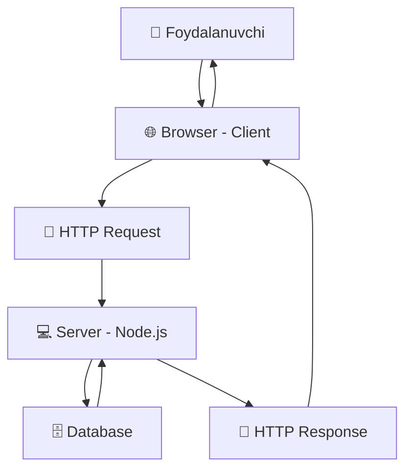

# Node.js bilan tanishuv

Assalom aleykum! Bu darsda biz **Node.js** bilan tanishamiz va server-side JavaScript dunyosiga birinchi qadamimizni qo'yamiz. Frontend (HTML, CSS, JavaScript, React) o'rgangach, endi backend tarafini ham o'rganishni boshlaymiz.

## O'qish rejasi

Bu darsda quyidagilarni o'rganasiz:
- 🌟 Node.js nima va nega muhim
- 🔄 Server vs Client - farqlar
- ⚙️ JavaScript Runtime tushunchasi
- 🛠️ Node.js'ning asosiy xususiyatlari
- 💻 Birinchi Node.js dasturimizni yozamiz
- 📦 NPM (Node Package Manager) bilan tanishuv

---

## Node.js nima?

**Node.js** - bu JavaScript dasturlash tilini browser'dan tashqarida, ya'ni server(computer)da ishlatishga imkon beruvchi muhit (runtime environment) hisoblanadi.

### Oddiy tilda tushuntirish:

Avval JavaScript faqat browser ichida ishlashga mo'ljallangan til edi:
```
🌐 Browser → JavaScript → Website'dagi harakatlar
```

Node.js paydo bo'lishi bilan:
```
💻 Computer/Server → JavaScript → Backend dasturlar
```


### Real hayotdan misol:

Tasavvur qiling, siz restoran egasi sizlar:

- **Frontend (Client)** = Ofitsiant → mijozlar bilan gaplashadi
- **Backend (Server)** = Oshpaz → ovqat tayyorlaydi, ma'lumotlar bazasi bilan ishlaydi

Node.js orqali "oshpaz" ham JavaScript tilida "gaplasha" oladi!

---

## Server vs Client - Farq nima?

### Client (Mijoz) taraf:
- 🌐 **Browser'da ishlaydi** (Chrome, Safari, Firefox)
- 👤 **Foydalanuvchi bilan to'g'ridan-to'g'ri** muloqot qiladi
- 📱 **UI/UX** - ko'rinish va foydalanuvchi tajribasi
- 🎨 **Frontend teknologiyalari**: HTML, CSS, JavaScript, React

### Server (Server) taraf:
- 💻 **Komputer/server'da ishlaydi**
- 🗄️ **Ma'lumotlar bazasi bilan** ishlaydi
- 🔐 **Xavfsizlik va autentifikatsiya** qiladi
- 📊 **Business logika** - asosiy ishlar bajariladi
- ⚙️ **Backend teknologiyalari**: Node.js, Python, Java, C#



---

## JavaScript Runtime nima?

**Runtime** - bu dasturlash tilini "yugurish" uchun zarur bo'lgan muhit.

### Browser Runtime:
```javascript
// Browser ichida
console.log("Salom Browser!"); // ✅ Ishlaydi
document.getElementById("button"); // ✅ Browser APIs
window.location = "new-page.html"; // ✅ Browser APIs
```

### Node.js Runtime:
```javascript
// Server/Computer ichida
console.log("Salom Server!"); // ✅ Ishlaydi
const fs = require('fs'); // ✅ File System APIs
const http = require('http'); // ✅ Server APIs
// document.getElementById() // ❌ Browser API yo'q!
```

### V8 Engine:
Node.js **Google Chrome'ning V8 JavaScript engine**idan foydalanadi. Bu juda tez va samarali.

```
📋 JavaScript kod → 🔧 V8 Engine → 💻 Computer/Machine Code
```

---

## Node.js'ning asosiy xususiyatlari

### 1. 🔄 Asynchronous (Asinxron)

**Oddiy tilda**: Node.js bir vaqtning o'zida ko'p ishlarni qilishi mumkin.

**Real hayot misoli**:
- Oddiy restoran: 1 ta ofitsiant → 1 ta mijoz
- Node.js restoran: 1 ta ofitsiant → 10 ta mijozni parallel xizmat qiladi

```javascript
// Asinxron kod misoli
console.log("1. Birinchi ish");

setTimeout(() => {
  console.log("2. Ikkinchi ish (2 soniyadan keyin)");
}, 2000);

console.log("3. Uchinchi ish");

// Natija:
// "1. Birinchi ish"
// "3. Uchinchi ish"
// "2. Ikkinchi ish (2 soniyadan keyin)"
```

### 2. ⚡ Single Thread, lekin Scalable

- **Single Thread** = 1 ta asosiy "ishchi"
- **Event Loop** = Ishlarni samarali taqsimlash tizimi
- **High Performance** = Juda tez va kam resurs ishlatadi

### 3. 📦 NPM - Ulkan ekotizma

**NPM** (Node Package Manager) - dunyoning eng katta dasturiy ta'minot kutubxonasi.

```bash
# Masalan, vaqt bilan ishlash uchun
npm install moment

# So'ngra kodda
const moment = require('moment');
console.log(moment().format('DD.MM.YYYY')); // "29.03.2026"
```

**Ma'lumotlar**:
- 📊 2+ million paketlar
- 📈 Har kuni yangi paketlar qo'shiladi
- 🌐 Butun dunyo developerlari foydalanyapti

---

## Birinchi Node.js dasturimiz

### 1. Node.js o'rnatish

**MacOS/Linux:**
```bash
# Homebrew orqali
brew install node

# Yoki nodejs.org saytdan yuklab oling
```

**Windows:**
- [nodejs.org](https://nodejs.org) saytiga boring
- LTS versiyani yuklab oling va o'rnating

### 2. Tekshirish:
```bash
node --version  # v18.17.0
npm --version   # 9.8.1
```

### 3. Birinchi dastur - Oddiy server

`server.js` nomli fayl yarating:

```javascript
// Birinchi Node.js server
const http = require('http');

// Server sozlamalari
const hostname = '127.0.0.1'; // localhost
const port = 3000;

// HTTP server yaratamiz
const server = http.createServer((req, res) => {
  // Response header o'rnatamiz
  res.statusCode = 200;
  res.setHeader('Content-Type', 'text/html; charset=utf-8');

  // Uzbek tilida javob qaytaramiz
  res.end(`
    <h1>Salom, Node.js server!</h1>
    <p>Bu sizning birinchi Node.js dasturingiz 🎉</p>
    <p>Vaqt: ${new Date().toLocaleString('uz-UZ')}</p>
  `);
});

// Serverni ishga tushiramiz
server.listen(port, hostname, () => {
  console.log(`✅ Server ishlamoqda: http://${hostname}:${port}/`);
  console.log(`🚀 Brauzeringizda yuqoridagi linkni oching!`);
});
```

### 4. Dasturni ishga tushirish:

```bash
# Terminal'da
node server.js
```

```
✅ Server ishlamoqda: http://127.0.0.1:3000/
🚀 Brauzeringizda yuqoridagi linkni oching!
```

Browser'da `http://127.0.0.1:3000` manzilini oching — sizning birinchi Node.js serveringiz!

---

## NPM bilan birinchi tanishuv

### NPM nima?

**Node Package Manager** - Node.js bilan birga o'rnatiluvchi paket menejeri.

### Asosiy buyruqlar:

```bash
# Yangi proyekt boshlash
npm init -y

# Paket o'rnatish
npm install express

# Global paket o'rnatish
npm install -g nodemon

# Barcha paketlarni o'rnatish
npm install

# Paketni o'chirish
npm uninstall express
```

### package.json fayli:

```json
{
  "name": "birinchi-nodejs-app",
  "version": "1.0.0",
  "description": "Birinchi Node.js dasturim",
  "main": "server.js",
  "scripts": {
    "start": "node server.js",
    "dev": "nodemon server.js"
  },
  "dependencies": {
    "express": "^4.18.0"
  }
}
```

---

## Amaliy mashq 💪

### Vazifa 1: Shaxsiy server yarating

```javascript
// personal-server.js
const http = require('http');

const server = http.createServer((req, res) => {
  res.statusCode = 200;
  res.setHeader('Content-Type', 'text/html; charset=utf-8');

  // Bu yerga o'zingiz haqingizda ma'lumot kiriting
  res.end(`
    <h1>Mening shaxsiy serverim</h1>
    <h2>Men: [ISMINGIZ]</h2>
    <p>Yosh: [YOSHINGIZ]</p>
    <p>Shahar: [SHAHARINGIZ]</p>
    <p>Orzuim: [ORZUNANGIZ]</p>
    <p>Node.js o'rganishga boshlagan san: ${new Date().toLocaleDateString('uz-UZ')}</p>
  `);
});

server.listen(3001, () => {
  console.log('Shaxsiy server: http://localhost:3001');
});
```

### Vazifa 2: Matematik kalkulyator API

```javascript
// calculator.js
const http = require('http');
const url = require('url');

const server = http.createServer((req, res) => {
  const parsedUrl = url.parse(req.url, true);
  const query = parsedUrl.query;

  res.statusCode = 200;
  res.setHeader('Content-Type', 'application/json; charset=utf-8');

  if (parsedUrl.pathname === '/add') {
    const a = parseFloat(query.a) || 0;
    const b = parseFloat(query.b) || 0;
    const result = a + b;

    res.end(JSON.stringify({
      operation: 'qo\'shish',
      a: a,
      b: b,
      natija: result
    }, null, 2));
  } else {
    res.end(JSON.stringify({
      error: 'Noto\'g\'ri yo\'l. /add?a=5&b=3 ko\'rinishida yuboring'
    }));
  }
});

server.listen(3002, () => {
  console.log('Kalkulyator: http://localhost:3002/add?a=5&b=3');
});
```

Test qilish: `http://localhost:3002/add?a=10&b=20`

---

## Xulosa va keyingi qadam

### 🎯 Bu darsda o'rgandiklar:

✅ **Node.js** - JavaScript'ni server tarafda ishlatish muhiti
✅ **Server vs Client** - farqlar va vazifalar
✅ **JavaScript Runtime** - kod qanday bajariladi
✅ **Asynchronous programming** - parallel ishlar
✅ **NPM** - paket menejeri va ekotizma
✅ **Birinchi server** - HTTP server yaratdik

### 🚀 Keyingi darsda:

- **Module система** - kodni qanday tashkil qilish
- **CommonJS** - require/exports
- **NPM packages** - chuqurroq o'rganish
- **File System** - fayllar bilan ishlash

### 📚 Qo'shimcha resurslar:

- [Node.js rasmiy hujjatlari](https://nodejs.org/docs)
- [NPM rasmiy sayti](https://npmjs.com)
- [JavaScript.info - Node.js](https://javascript.info/node-intro)

---

<Callout type="success" title="Tabriklaymiz! 🎉">
Siz endi Node.js bilan tanishdingiz va birinchi server dasturingizni yaratdingiz! Bu backend development yo'lida muhim qadam. Keyingi darslarda yanada qiziqroq loyihalar yaratamiz.
</Callout>

<Callout type="info" title="Maslahat 💡">
Har kuni kamida 30 daqiqa Node.js bilan amaliyot qiling. Backend development - bu amaliyot orqali o'rganiladigan ko'nikma. Qo'rqmang, xato qilishdan o'rganasiz!
</Callout>

**Keyingi dars**: [Node.js Modules va NPM](/docs/nodejs/02-nodejs-modules-npm)